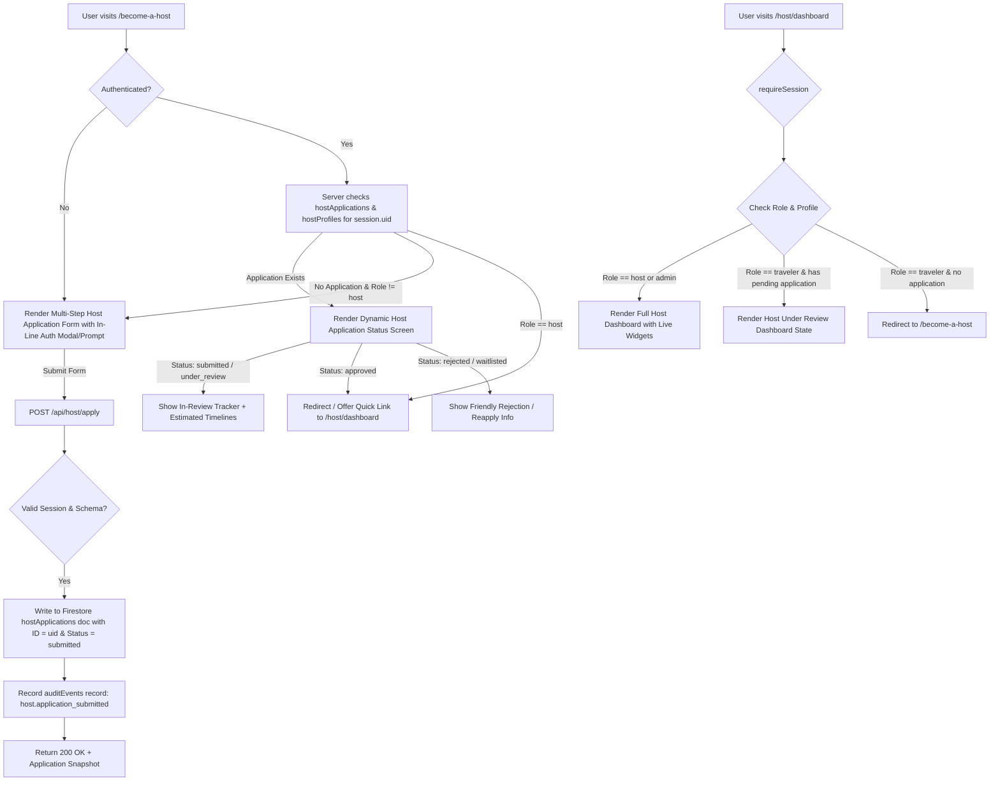

# Implementation Plan — Phase 3: The Complete Host Journey & Verification Pipeline

Phase 3 transitions Bleetary Travels from static host capture quizzes to an end-to-end host onboarding, verification lifecycle, and live dashboard system wired to our Firestore database schema and RBAC session architecture.

---

## 1. Architectural Analysis & Core Flows



---

## 2. Proposed System Architecture & Component Blueprint

### A. Dynamic Host Application Pipeline (`app/become-a-host/page.tsx`)
- **Server-Side Hydration & Status Evaluation**:
  - `BecomeAHostPage` is an `async` Server Component.
  - Queries `getCurrentSession()`.
  - If authenticated, fetches `hostApplications/{uid}` via Admin SDK (`getHostApplication(session.uid)`).
  - If application exists, renders `<HostApplicationStatus application={...} />`.
  - If approved / user is already a `host`, offers direct jump to `/host/dashboard`.
  - If unauthenticated or no application, fetches available published destinations and passes them to `<HostApplicationWizard initialUser={session} availableDestinations={destinations} />`.

- **Multi-Step Form Wizard (`components/host/HostApplicationWizard.tsx`)**:
  - **Step 1: Community & Brand**: Community Name, Community Type (`newsletter`, `podcast`, `social`, `fitness`, `travel_club`, `other`), Primary URL.
  - **Step 2: Audience & Reach**: Audience Size tier / count, Instagram Handle, TikTok Handle, YouTube / Substack URL.
  - **Step 3: Vision & Target Destinations**: Bio / Hosting Philosophy, Multi-select Target Destinations (sourced from catalog or custom input), Previous Hosting Experience (`hasHostedBefore`, `previousHostingDetails`).
  - **Step 4: Review & Auth Bridge**:
    - If user is unauthenticated: Displays embedded auth step (Sign in / Register) with progress preserved in client state / `sessionStorage`, automatically resuming submission upon auth.
    - If user is authenticated: One-click "Submit Application" with instant optimistic feedback.

- **Application Status View (`components/host/HostApplicationStatusCard.tsx`)**:
  - Displays dynamic badge: `Submitted`, `Under Review`, `Approved`, `Waitlisted`, `Rejected`.
  - Timeline stepper indicating where the application is in the verification pipeline.
  - Snapshot of submitted details (destinations, audience, socials).
  - Help / contact concierge links and re-application actions if rejected.

---

### B. API Route for Submissions (`app/api/host/apply/route.ts`)
- **Security & Integrity Checks**:
  - CSRF / Origin validation via `isSameOrigin(request)`.
  - Caller authentication using `authorizeRequest(request)` (session cookie verification).
  - Idempotency / Duplicate protection: Checks if an active application (`submitted`, `under_review`, `approved`) already exists for `session.uid`.
- **Validation**:
  - Zod validation strictly matching `HostApplicationDocument` in [`lib/db/schema.ts`](file:///Users/widneys/Projects/Bleetary%20Travels/bleetary-travels/lib/db/schema.ts):
    ```ts
    const hostApplicationPayloadSchema = z.object({
      communityName: z.string().trim().min(2).max(100),
      communityType: z.string().trim().min(2).max(50),
      audienceSize: z.number().int().min(0).max(100_000_000),
      communityUrl: z.string().url().nullable().optional(),
      instagramHandle: z.string().trim().regex(/^@?[\w.]{1,30}$/).nullable().optional(),
      tiktokHandle: z.string().trim().regex(/^@?[\w.]{1,30}$/).nullable().optional(),
      bio: z.string().trim().min(20).max(2000),
      proposedDestinations: z.array(z.string().trim().min(2).max(80)).min(1).max(10),
      hasHostedBefore: z.boolean(),
      previousHostingDetails: z.string().trim().max(1000).nullable().optional(),
    });
    ```
- **Database & Audit Writes**:
  - Write document to `hostApplications/{session.uid}` using Firebase Admin SDK with `serverTimestamp()`.
  - Record audit entry in `auditEvents/{eventId}`:
    ```ts
    {
      actorUid: session.uid,
      action: "host.application_submitted",
      targetType: "hostApplications",
      targetId: session.uid,
      metadata: { communityName, audienceSize },
      reason: "User submitted initial host application",
      createdAt: FieldValue.serverTimestamp()
    }
    ```

---

### C. Protected Host Dashboard Integration (`app/host/dashboard/page.tsx`)
- **Server-Side Access Control & Status Routing**:
  - Requires session via `requireSession("/host/dashboard")`.
  - If `session.role === "admin"` or `session.role === "host"`: renders full dashboard.
  - If `session.role === "traveler"`:
    - Fetches `hostApplications/{session.uid}`.
    - If status is `submitted` or `under_review`: renders `<HostUnderReviewBanner />` or pending workspace with limited sandbox features (e.g. preview survey builder, sample itinerary explorer).
    - If no application found: redirects to `/become-a-host`.
- **Live Firestore Widget Integrations**:
  1. **Audience Survey Widget (`GatherInterestWidget`)**:
     - Queries `interestResponses` where `ownerUid == session.uid`.
     - Displays actual response count towards the 100-response milestone (`responses.length / 100`).
     - Renders unique host survey link `https://bleetary.com/survey/{session.uid}`.
  2. **Rewards & Referral Tracker (`RewardsSummary`)**:
     - Queries `referrals` where `referrerUid == session.uid`.
     - Calculates total referrals, confirmed trips, and unlocked dollar rewards.
  3. **Trip Proposals & Launch Steps (`LaunchSteps`)**:
     - Queries `trips` and `tripDepartures` where `hostUid == session.uid`.
     - Dynamically un-locks Step 3 & Step 4 once interest threshold is achieved or draft trips are created.

---

## 3. Proposed File Structure Changes

```
bleetary-travels/
├── app/
│   ├── api/
│   │   └── host/
│   │       ├── apply/
│   │       │   └── route.ts               # [NEW] Submissions endpoint with audit logging & Zod validation
│   │       ├── applications/              # [UPDATE/CONSOLIDATE] Ensure consistency with schema
│   │       └── survey/
│   │           └── route.ts               # [NEW] Survey interest response collection endpoint
│   ├── become-a-host/
│   │   └── page.tsx                       # [MODIFY] Server component handling auth state, pending app checks, wizard
│   └── host/
│       └── dashboard/
│           └── page.tsx                   # [MODIFY] Wired to live interestResponses, referrals, pending banner
├── components/
│   └── host/
│       ├── HostApplicationWizard.tsx     # [NEW] Multi-step rich interactive application form
│       ├── HostApplicationStatusCard.tsx # [NEW] Live application status & review tracker
│       ├── HostUnderReviewBanner.tsx      # [NEW] Pending application view for travelers awaiting host review
│       ├── HostInterestWidget.tsx         # [NEW/MODIFY] Interactive interest counter wired to Firestore
│       ├── HostRewardsSummary.tsx         # [NEW/MODIFY] Dynamic referrals and payout counter
│       ├── CopyLinkButton.tsx             # [EXISTING]
│       └── HostNavigation.tsx             # [EXISTING]
├── lib/
│   ├── db/
│   │   ├── hosts.ts                       # [MODIFY] Add getHostApplication, getUserHostState, getHostMetrics
│   │   ├── interests.ts                   # [NEW] Server queries for interestResponses
│   │   ├── referrals.ts                   # [NEW] Server queries for host referrals
│   │   └── audit.ts                       # [NEW] Helper for writing auditEvents
│   └── validation/
│       └── host-application.ts           # [NEW] Shared Zod schemas & client types
└── tests/
    ├── api/
    │   └── host-apply.test.ts             # [NEW] API route tests (auth, validation, idempotency, audit)
    └── components/
        └── host-wizard.test.tsx           # [NEW] Multi-step form transition & validation tests
```

---

## 4. Verification & Testing Plan

### Automated Tests
1. **API Integration & Unit Tests (`tests/api/host-apply.test.ts`)**:
   - Rejects unauthenticated requests with `401 Unauthorized`.
   - Rejects invalid origin with `403 Forbidden`.
   - Rejects malformed payload (missing bio, audienceSize out of bounds) with `400 Bad Request`.
   - Returns `409 Conflict` if active application already exists.
   - Successfully creates application doc in `hostApplications` with ID matching `session.uid` and logs to `auditEvents`.
2. **Component & Flow Tests (`components/HostQuiz.test.tsx` / `tests/components/host-wizard.test.tsx`)**:
   - Validates forward and backward navigation across all wizard steps.
   - Validates field constraints before proceeding to subsequent steps.
   - Renders pending review status screen when an existing application is loaded.
3. **End-to-End Build & Lint**:
   - `npm run typecheck`
   - `npm run lint`
   - `npm run test`
   - `npm run build`

---

## 5. Architectural Alignment Questions (For Review)

1. **Host Application ID Strategy**:
   - *Option A (Recommended)*: Document ID is set directly to `session.uid` (`hostApplications/{uid}`). Ensures strict 1:1 active application per account and simplifies security rules and status lookup.
   - *Option B*: Auto-generated document ID with `ownerUid` query. Allows historical re-applications if a past one was rejected.
2. **Unauthenticated Wizard Flow**:
   - *Option A (Recommended - In-Flow Modal/Step)*: Let visitors fill out steps 1–3, and at Step 4 prompt them to Login/Register with form state persisted, submitting immediately upon account creation.
   - *Option B (Gate First)*: Require sign-in/registration before seeing step 1 of the application form.
3. **Pending Traveler Access to `/host/dashboard`**:
   - *Option A (Recommended - Soft Dashboard / Under Review View)*: Allow users with `submitted`/`under_review` applications into `/host/dashboard`, showing a prominent "Application Under Review" banner alongside a preview mode of host tools.
   - *Option B (Hard Gate)*: Redirect pending applicants to `/become-a-host` (status view) until an admin explicitly promotes their role to `host`.
